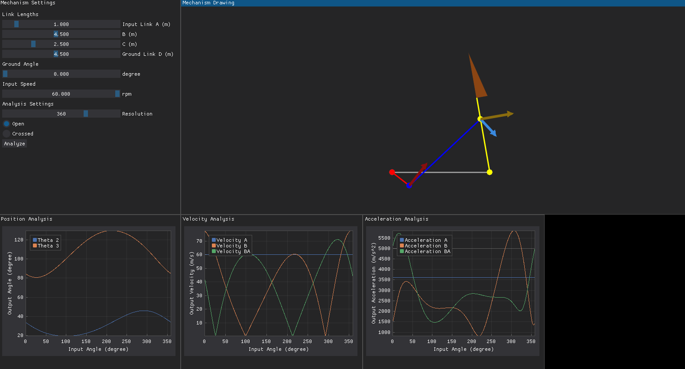

# Mechanism-Analysis



## Introduction

This is the source code for the mechanism analysis program developed for the MECH330 - Machine Design course at Qatar University. The program is designed to analyze the kinematics and dynamics of a four-bar linkage mechanism, simulate the motion of the mechanism, and calculate the forces and torques acting on the mechanism's links. It also offers insights into the performance of the mechanism and its factor of safety.

## Getting Started

To get started, clone this repository to your local machine. Then install the required packages using the following command:

```bash
pip install -r requirements.txt
```

Once the required packages are installed, you can navigate to the `main.py` file and run the program using the following command:

```bash
python main.py
```

## Future Work

The program is still under development and will be updated with new features and improvements in the future. Some of the planned updates include:

### Required
- [ ] Mechanism dynamic force analysis for all links and at knife-edge
- [ ] Mechanism factor of safety and performance analysis
- [ ] Ability to change the link lengths, ground angle, input speed, and mechanism position (open or crossed)
- [ ] Path tracing of rocker linkage
- [ ] Add slider to set input angle and automatically update mechanism
- [ ] Show current angles, velocities, and accelerations in each of their plots 

### Extra
- [ ] Refactor program to calculate joint positions inside lib.py, then use these to calculate min and max bounding boxes and plots for dimension changes
- [ ] Slow down simulation and jump to specific time or angle
- [ ] Plots for omega and alpha values
- [ ] Marker showing current input angle in plots
- [ ] Arrows showing acceleration vectors
- [ ] Arcs showing current angle of links
- [ ] Isolate a single link and show the changes in its angle, velocity, and acceleration
- [ ] Add ability to move the offset position

